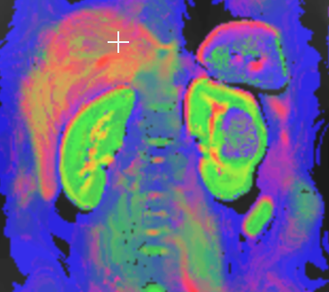

# RGB-tri
RGBtri is a tool for the creation of color-coded maps of the diffusion components of triexponential diffusion-weighted imaging (DWI).

The inputs to RGBtri are maps of the fast (Ff) and intermediate (Fi) diffusion components. 
The slow component (Fs) is calculated internally by the equation Fd = 1 - Fi - Ff.
The output of RGBtri is a color-coded parametric image, where Ff uses the red, Fi the green, and Fs the blue color channel.

The syntax of RGBtri is quite simple: "RGBtri -Ff file1.nii -Fi file2.nii -o output.nii".
Type "RGBtri -h" for more details.
Some test data is available in the "test-data" directory.

The algorithms presented here are described in: 
"Presentation of microstructural diffusion components by color schemes in abdominal organs" in Magnetic Resonance in Medicine 
Article DOI: 10.1002/mrm.30183

C++ code is provided to create RGB diffusion component maps. A cmake file has been added for compilation.
Since RGBtri software works with Nifti images, the only dependency is the Nifti package: https://github.com/NIFTI-Imaging/nifti_clib
