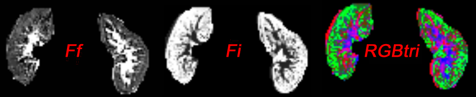

# RGB-tri
RGBtri is a tool for the creation of color-coded maps of the diffusion components 
of triexponential diffusion-weighted imaging (DWI). 
The following triexponential modes is presumed:

S(b)/S0 = Fs e-bDs + Fi e-bDi + Ff e-Df.

RGBtri merges the diffusion fraction of slow, intermediate, and fast components int one rgb image. 

The inputs to RGBtri are maps of the fast (Ff) and intermediate (Fi) diffusion components. 
_(Ff and Fi should be scaled as a percentage so that their values range from 0 to 100. 
If Ff and Fi are between 0 and 1, use the "-f" option when running RGBtri.)_
The slow component (Fs) is calculated internally by the equation 
Fs = 1 - Fi - Ff.
The output of RGBtri is a color-coded parametric image, where Ff uses the red, Fi 
the green, and Fs the blue color channel.

The syntax of RGBtri is quite simple: _"RGBtri -Ff file1.nii -Fi file2.nii -o output.nii"_.
Type _"RGBtri -h"_ for more details.
Some test data is available in the _"test-data"_ directory.
A Windows executable is provided in the _"win-binary"_ directory.
A Linux executable (Ubuntu 22.04.4 LTS) can be found in _"ubuntu-binary"_ directory.

The algorithms presented here are described in: 
**"Presentation of microstructural diffusion components by color schemes in abdominal organs"** in Magnetic Resonance in Medicine.
Article DOI: 10.1002/mrm.30183

C++ code is provided to create RGB diffusion component maps. A cmake file has been added for compilation.
Since RGBtri software works with Nifti images, the only dependency is the Nifti package: https://github.com/NIFTI-Imaging/nifti_clib
